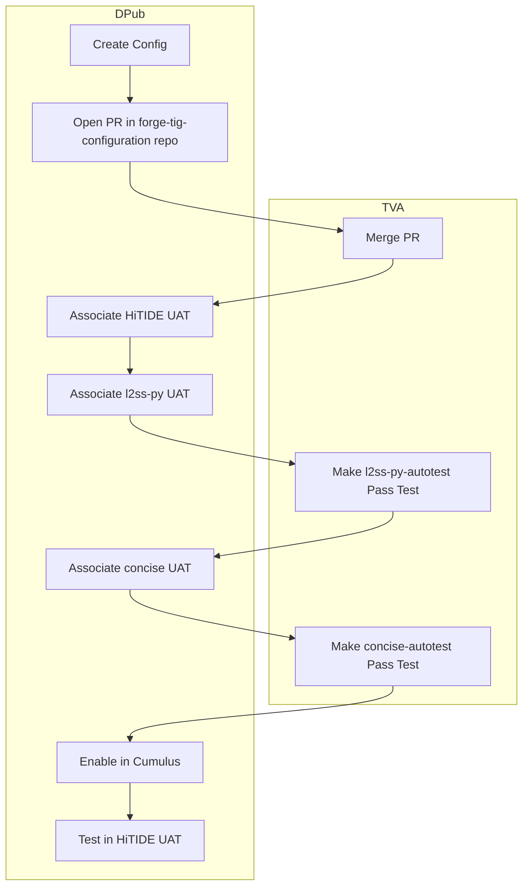

# Add Collection To HiTIDE (HiTIDE/l2ss-py/concise)

```mermaid
flowchart TB
    subgraph TVA
    h1[Merge PR]
    h2[Make l2ss-py-autotest Pass Test]
    h3[Make concise-autotest Pass Test]
    end
    subgraph DPub
    c1[Create Config]-->c2[Open PR in forge-tig-configuration repo]
    c2-->h1
    h1-->c3[Associate HiTIDE UAT]
    c3-->c4[Associate l2ss-py UAT]
    c4-->h2
    h2-->c5[Associate concise UAT]
    c5-->h3
    h3-->c6[Enable in Cumulus]
    c6-->c7[Test in HiTIDE UAT]
    end
    click h1 "https://github.com/podaac/hitide/blob/main/merge-pr.md" "Details" _blank
```
