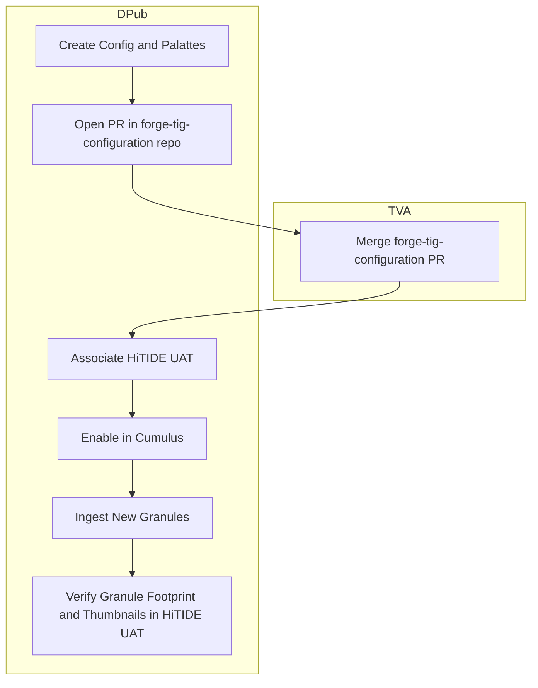

### Add New Collection with Thumbnails and Footprints to HiTIDE

```mermaid
flowchart TB
    subgraph TVA
    h1[Merge forge-tig-configuration PR]
    end
    subgraph DPub
    c1[Create Config and Palattes]-->c2[Open PR in forge-tig-configuration repo]
    c2-->h1
    h1-->c3[Associate HiTIDE UAT]
    c3-->c6[Enable in Cumulus]
    c6-->c7[Ingest New Granules]
    c7-->c8[Verify Granule Footprint and Thumbnails in HiTIDE UAT]
    end
    click h1 "https://github.com/podaac/hitide/blob/main/add-collection/merge-pr.md" "Details" _blank
```

##### Next Steps:

* Enable HiTIDE [Add Services](enable-services.md)
* Verify HiTIDE [Collection Info](enable-services.md)
