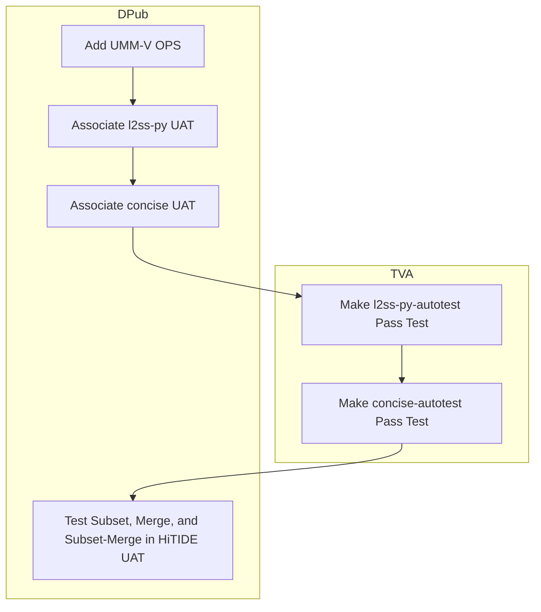

# Enable Services (l2ss-py and concise) on Collection

```mermaid
flowchart TB
    subgraph TVA
    h2[Make l2ss-py-autotest Pass Test]
    h3[Make concise-autotest Pass Test]
    end
    subgraph DPub
    c1[Add UMM-V OPS]
    c1-->c4[Associate l2ss-py UAT]

    c4-->c5[Associate concise UAT]
    c5-->h2
    h2-->h3
  
    c7[Test Subset, Merge, and Subset-Merge in HiTIDE UAT]

    h3-->c7
    end
    click h1 "https://github.com/podaac/hitide/blob/main/merge-pr.md" "Details" _blank
```
